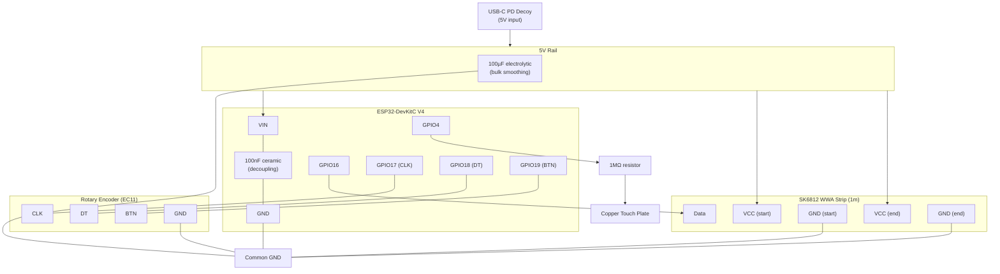

# Circuit Diagram

## Wiring Summary

### Power

| From | To | Wire |
|------|----|------|
| USB-C PD decoy 5V | ESP32 VIN | Red |
| USB-C PD decoy 5V | SK6812 VCC (start) | Red |
| USB-C PD decoy 5V | SK6812 VCC (end) | Red |
| USB-C PD decoy GND | Common GND | White |
| Common GND | ESP32 GND | White |
| Common GND | SK6812 GND (start) | White |
| Common GND | SK6812 GND (end) | White |
| Common GND | Encoder GND | White |

### Signals

| From | To | Via | Notes |
|------|----|-----|-------|
| ESP32 GPIO16 | SK6812 Data | Green | RMT data line |
| ESP32 GPIO4 | Copper touch plate | 1MΩ resistor | Static protection |
| Encoder CLK | ESP32 GPIO17 | — | Internal pull-up enabled |
| Encoder DT | ESP32 GPIO18 | — | Internal pull-up enabled |
| Encoder BTN | ESP32 GPIO19 | — | Internal pull-up enabled |

### Decoupling Capacitors

| Capacitor | Placement | Purpose |
|-----------|-----------|---------|
| 100µF electrolytic | 5V/GND near LED strip VCC | Absorbs current spikes when LEDs switch |
| 100nF ceramic | ESP32 VIN/GND | Suppresses high-frequency noise |

## Notes

- 100µF electrolytic cap: across 5V/GND near LED strip input — absorbs current spikes when LEDs switch
- 100nF ceramic cap: across ESP32 VIN/GND — suppresses high-frequency noise
- 1MΩ resistor: in series between GPIO4 and touch plate — protects pin from static discharge
- Encoder CLK/DT/BTN use ESP32 internal pull-ups (configured in ESPHome)
- SK6812 powered at both ends to avoid voltage drop across 1m strip
